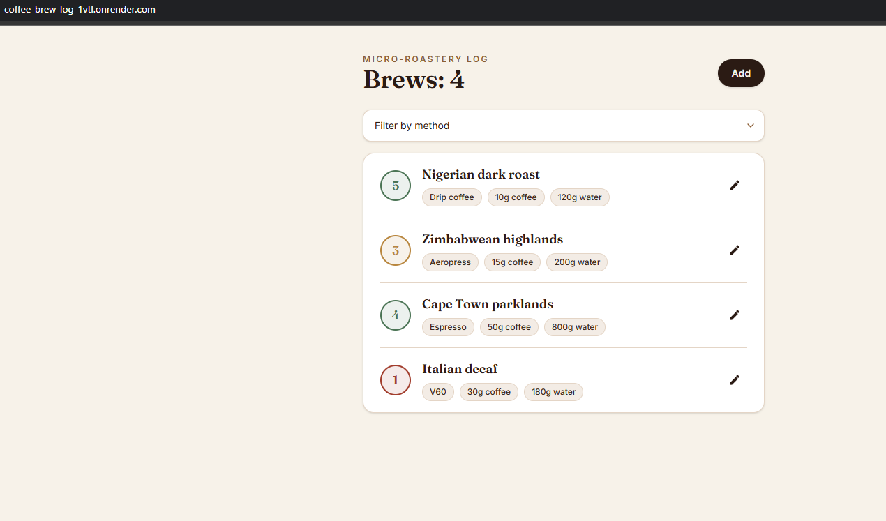
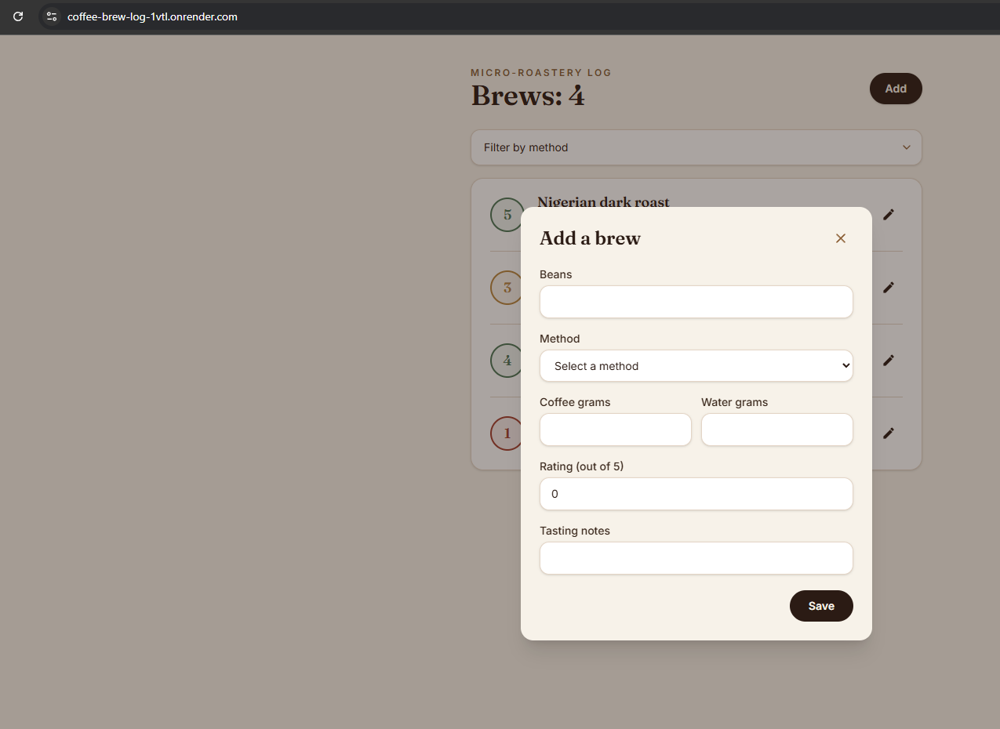
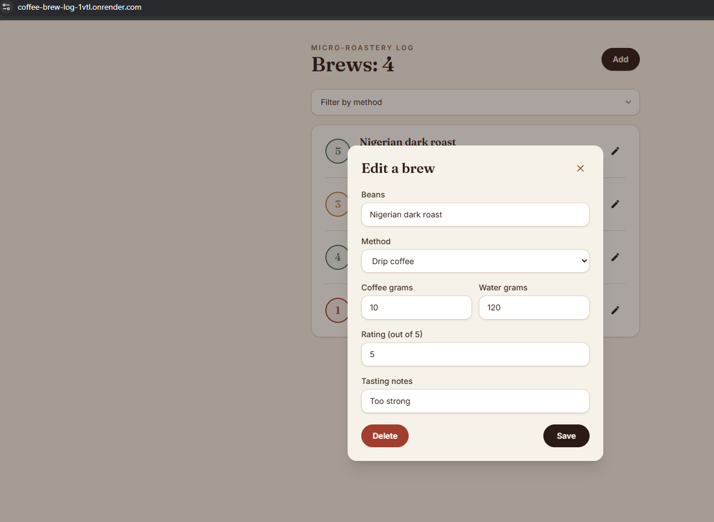
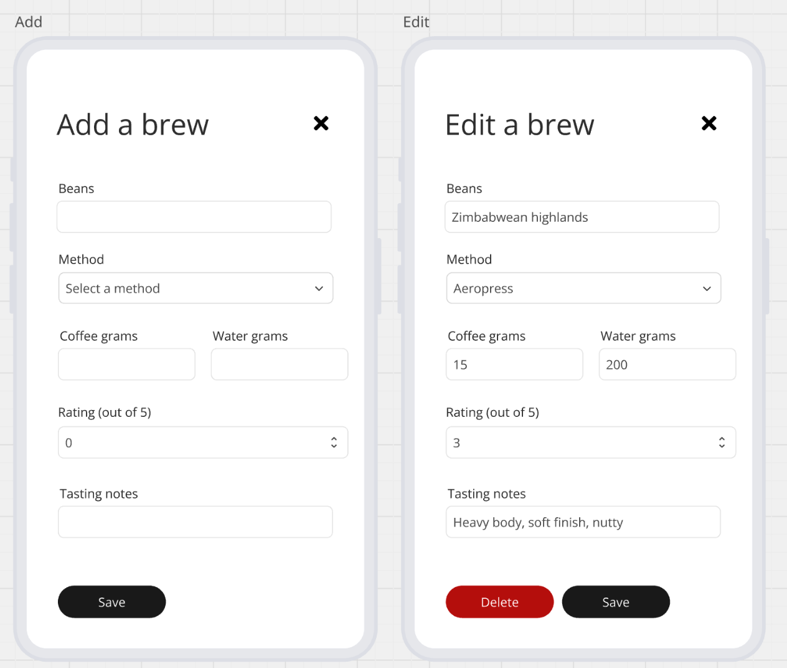

# Coffee Brew Log ☕

A full-stack app for logging coffee brews at a hipster micro-roastery. Built for the XPL Full-stack developer bootcamp assessment.

**Live app:** https://coffee-brew-log-1vtl.onrender.com
**API:** https://coffee-brew-log-api-l33d.onrender.com

> Note: both services run on Render's free tier, so the first request after a period of inactivity can take 30-60 seconds while the instance wakes up.

## Screenshots

### List view

### Add a brew

### Edit a brew

## What it does

- Create a brew entry (beans, method, coffee grams, water grams, rating, tasting notes)
- View all brews in a list, with a color-coded rating badge (green/amber/red)
- Filter the list by brew method
- Edit and update an existing entry
- Delete an entry
- Client- and server-side validation on all required fields

## Tech stack

- **Frontend:** React (Vite) + Tailwind CSS
- **Backend:** Node.js + Express
- **ORM / Database:** Prisma + PostgreSQL (hosted on Render)

## Project structure

- backend/ - Express API + Prisma schema
- frontend/ - React (Vite) app
- screenshots/ - App screenshots for this README
- Documentation.md - Setup instructions and API reference
- deployment.md - Deployment notes and troubleshooting log

## Local setup

See [Documentation.md](./Documentation.md) for full setup instructions, including environment variables and running the API/frontend locally.

## Deployment

See [deployment.md](./deployment.md) for how this was deployed to Render.

---

## Assignment brief

### Introduction

You're opening a hipster micro-roastery and need a tiny app to log each brew you make.

### Your mission

Ship a working full-stack Coffee Brew Log app that lets a user:

- Create a brew entry and save it to the database
- Read the brew log in a list view
- Filter the list view by brew method
- Edit and update a brew entry
- Delete a brew entry

### Wireframes

